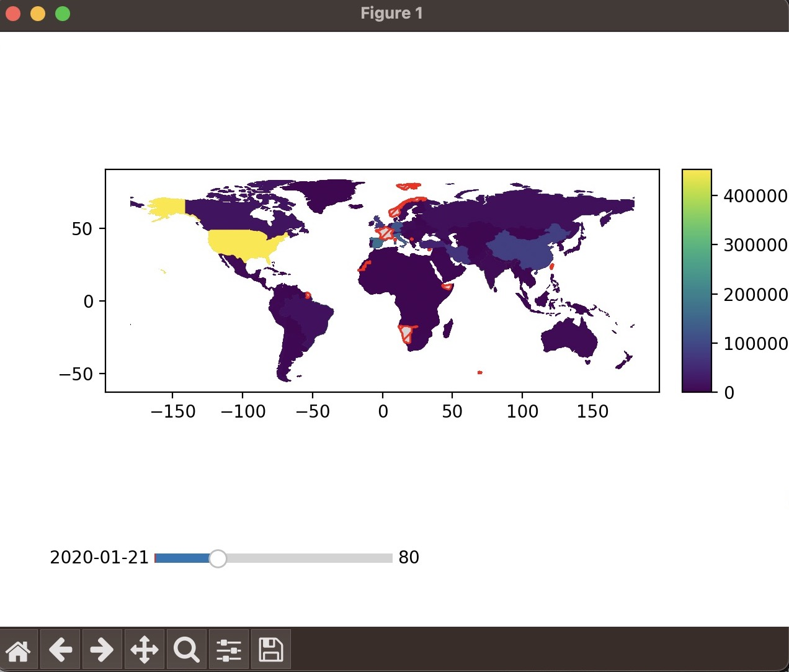
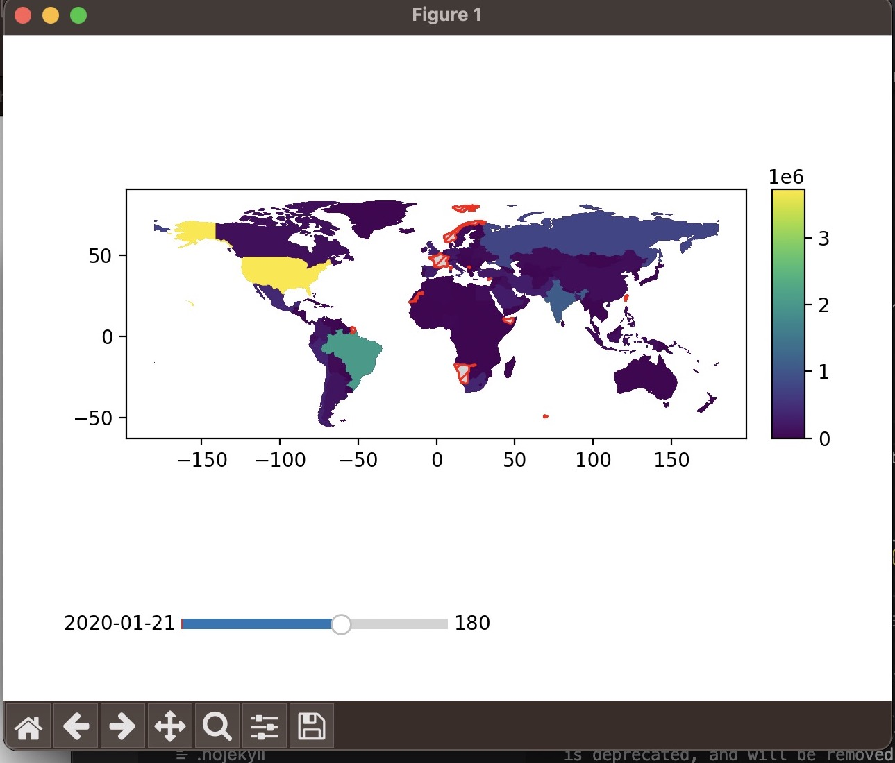
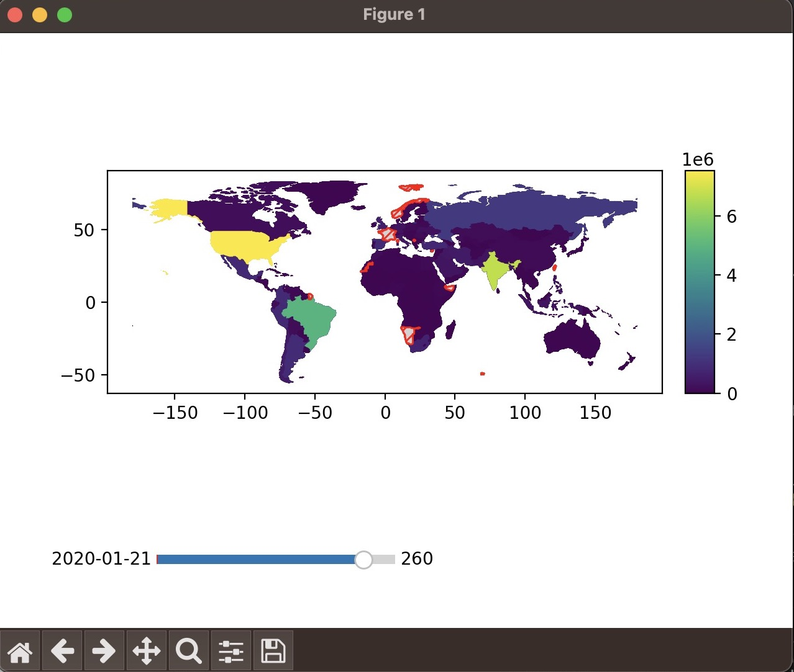

.. EpiSpread documentation master file, created by
   sphinx-quickstart on Wed Apr  5 10:12:28 2023.
   You can adapt this file completely to your liking, but it should at least
   contain the root `toctree` directive.

Welcome to EpiSpread's documentation
=====================================

.. toctree::
   :maxdepth: 2
   :caption: Contents:

   api

Indices and tables
==================

* :ref:`genindex`
* :ref:`modindex`
* :ref:`search`

Installation
==================
.. code-block::

       $ pip3 install epispread

Usage
==================
.. code-block::

       from epispread import EpiSpread

      my_epispread_object = EpiSpread(EpiSpread.FILE)
      epi_instance.world.to_csv('world.csv', index=False)
      epi_instance.plot_all()

